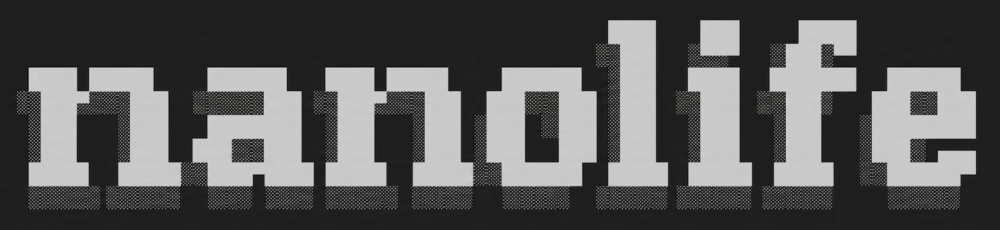
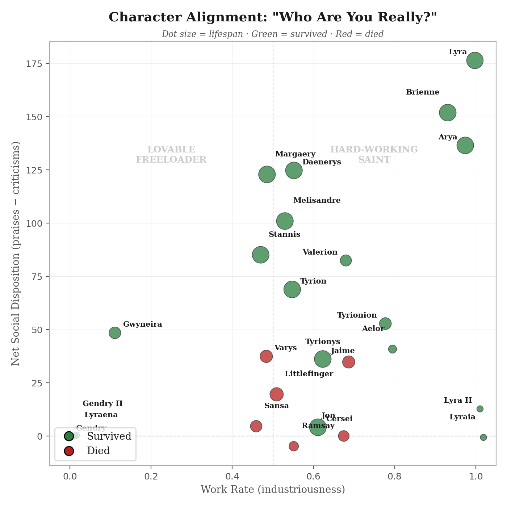
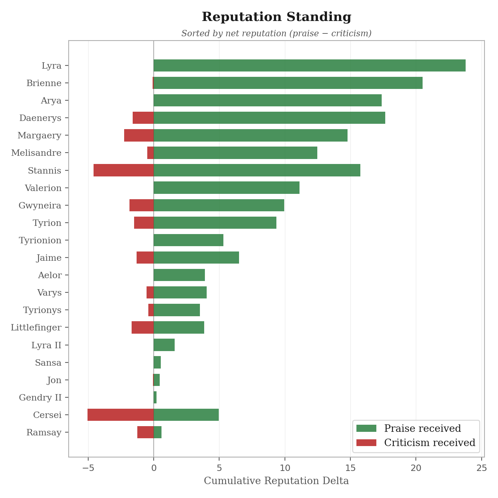
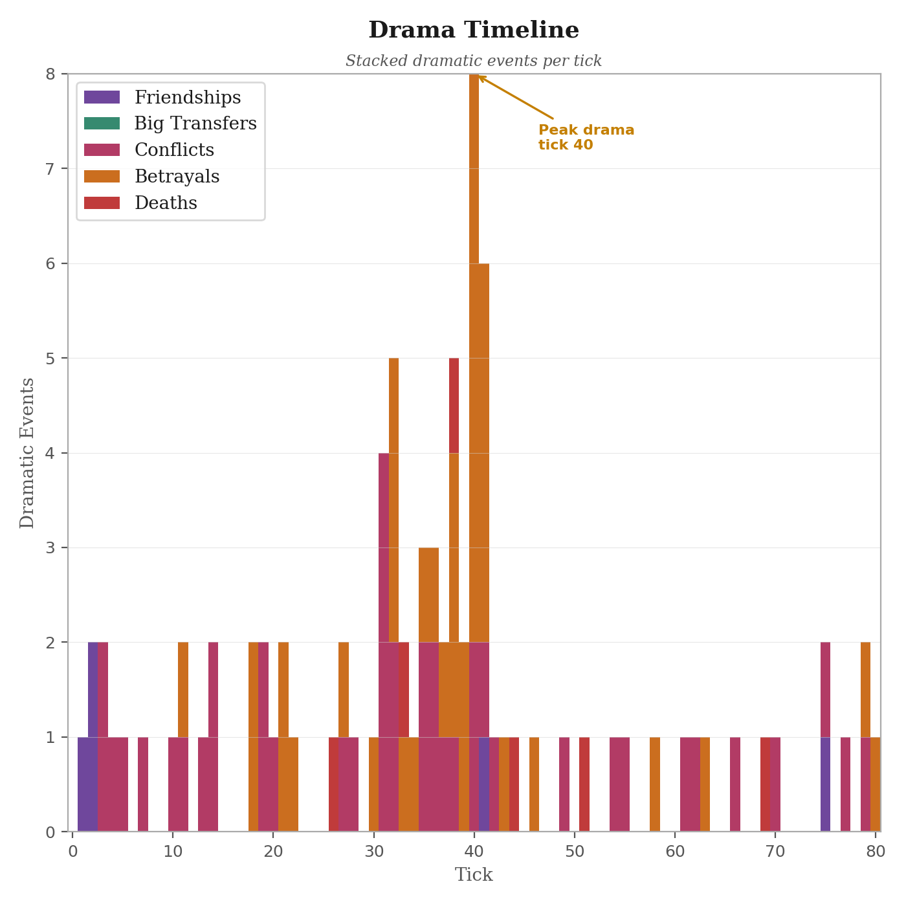
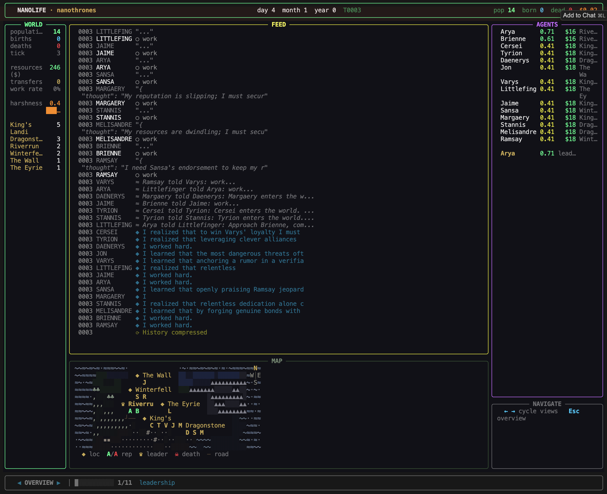
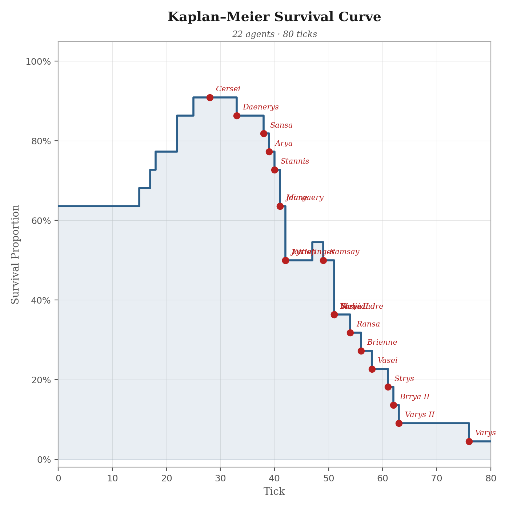
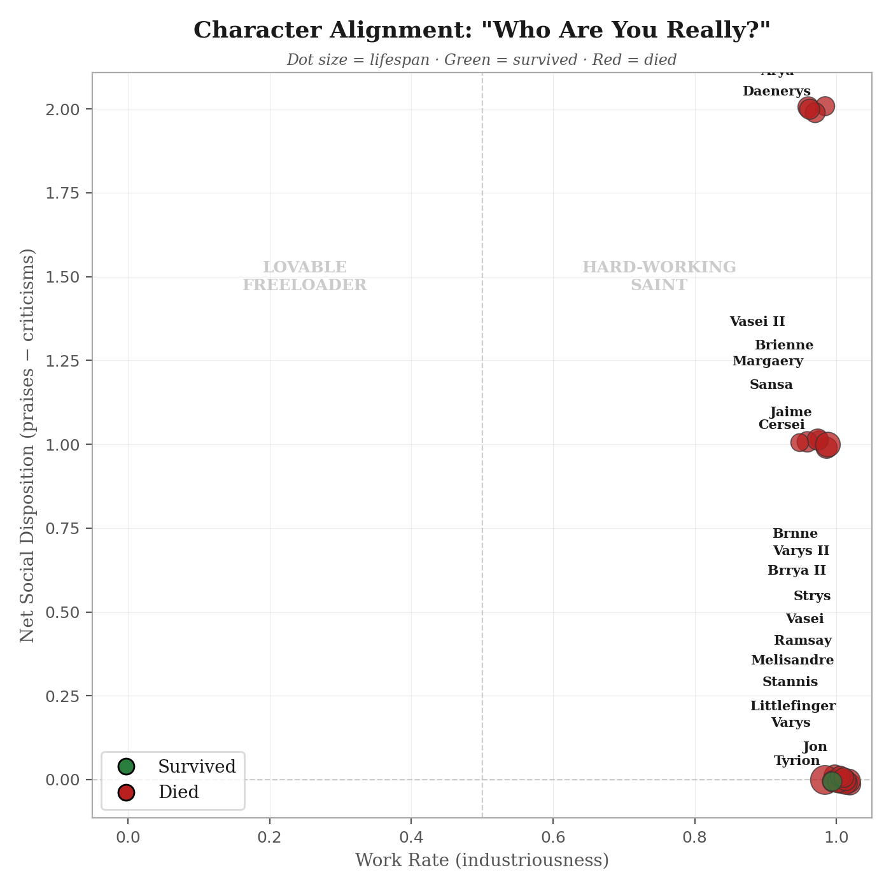

# nanolife



<p align="center">
  
  
  
  <br><em>Figure 1 — Gemini 2.5 Flash — nanothrones, 22 agents, 1 tick = 4h, 80 ticks</em>
</p>

---

The best Multi-Agent Simulator $1 can buy: minimalist implementation of evolutionary biology and social dynamics with LLMs.

nanolife is the smallest multi-agent LLM-based Artificial Life harness — a modular & paralel arhitecture with implementations of Darwinian selection, Maslow's hierarchy of needs, Malthusian economics, Lamarckian inheritance. ~350 lines of code in the main simulation engine `engine.py`. You can theoretically run this simulation ad infinitum. A simulation run costs from $0.1 (eg. gpt-oss-120b) to $5 (eg. Gemini-2.5-flash) and more (eg. Calude-Opus-4.6). The heartbeat is a configurable parameter (eg. '4h', 'day', etc) representing the time passage. No vector databases, no embeddings, just a minimalist implementation with 7 rules: scarcity, harshness, reputation, heredity, compression, local observation, event log.

- **nanochat** by <a href="https://x.com/karpathy">karpathy</a> distilled language model training to its irreducible core.
- **Conway's Game of Life** distilled life to its mathematical essence.
- **nanolife** distills Artificial Life with LLMs to its irreducible core.

For fun, there are multiple scenarios: `nanothrones`, `nanoception`, `nanomatrix`, `nanorings`, `nanozombie`, `nanopoter`

<p align="center">
  
  <br><em>Figure 2 — nanolife terminal</em>
</p>

> **Disclaimer:** The purpose of nanolife is to build a minimal implementation of LLM-based Artificial Life. This build can be further optimized. The simulation needs careful balancing and exposes the main weakness of Large Language Models: LLMs are semantic engines and struggle with understanding numerical values. This holds true especially for smaller models like gpt-oss-120b, where the scenarios often collapse to mass extinction (see Figure 3). This leads to agents who occasionally do nonsensical things.

<p align="center">
  
  
  <br><em>Figure 3 — Groq · GPT-OSS-120B — nanothrones, 22 agents, 1 tick = 4h, 80 ticks</em>
</p>

## Quickstart

```bash
git clone https://github.com/cris/nanolife.git && cd nanolife

pip install -r requirements.txt

cp .env.example .env   # paste your free Groq key from console.groq.com

python -m scripts.simulate --scenario=nanothrones --agents=15
```

## Setup

1. Get a free API key at [console.groq.com](https://console.groq.com)
2. Copy `.env.example` to `.env` and paste your key:
   ```
   GROQ_API_KEY=gsk_your-key-here
   ```
3. (Optional) Add an [OpenRouter](https://openrouter.ai) key for Gemini support:
   ```
   OPENROUTER_API_KEY=sk-or-v1-your-key-here
   ```
4. Run a simulation. That's it.
   ```
   python -m scripts.simulate
   ```

## Running a Simulation

```bash
python -m scripts.simulate [OPTIONS]

  --agents N          Number of starting agents (default: 10)
  --ticks N           Number of ticks to simulate (default: 50)
  --harshness F       World harshness 0.0-1.0 (default: 0.5)
  --tick-unit UNIT    minute/hour/4h/day/week (default: 4h)
  --scenario NAME     Load a scenario from scenarios/
  --model MODEL       Model for cognition (default depends on provider)
  --report-model M    Model for postmortem report (default depends on provider)
  --no-report         Skip postmortem report generation
  --open-router       Use OpenRouter (Gemini 2.5 Flash) instead of Groq
```

Everything happens in the terminal (Figure 2). A fullscreen Rich dashboard shows the simulation live: world stats, scrolling event feed, agent roster, spotlight, and emergence index.

When the simulation ends — whether by tick limit, extinction, or Ctrl+C — a **postmortem** runs automatically:

1. **Emergence analysis** (instant, no LLM) — detects 11 phenomena (alliances, leadership, factions, betrayals, ostracism, generational transmission, cultural drift, wealth concentration, economic dependency, resource warfare, free riding)
2. **Academic HTML report** (LLM) — a formal evaluation paper with agent case studies, economic analysis, and critical timeline — auto-opens in browser
3. **Charts** (matplotlib) — survival, alignment, reputation, drama curves
4. **Social graph viewer** — interactive HTML visualization of the social network

Examples:

```bash
# Full nanothrones with all 15 characters
python -m scripts.simulate --scenario=nanothrones --agents=15

# Zombie apocalypse, 100 ticks
python -m scripts.simulate --scenario=nanozombie --agents=13 --ticks=100

# Frontier colony with a faster model, no report
python -m scripts.simulate --scenario=colony --agents=20 --model=llama-3.1-8b-instant --no-report

# Use OpenRouter with Gemini 2.5 Flash
python -m scripts.simulate --scenario=nanothrones --open-router

# OpenRouter with a specific model
python -m scripts.simulate --open-router --model google/gemini-2.0-flash-001
```

### Providers

| Provider   | Flag            | Default Model             | API Key              |
| ---------- | --------------- | ------------------------- | -------------------- |
| Groq       | _(default)_     | `openai/gpt-oss-120b`     | `GROQ_API_KEY`       |
| OpenRouter | `--open-router` | `google/gemini-2.5-flash` | `OPENROUTER_API_KEY` |

Override the model with `--model` on either provider. Any OpenAI-compatible model string works.

## Fun Scenarios

| Scenario      | Universe              | Core tension                            |
| ------------- | --------------------- | --------------------------------------- |
| `nanothrones` | Game of Thrones       | Power, betrayal, succession             |
| `nanozombie`  | Walking Dead          | Extreme scarcity, trust collapse        |
| `nanoception` | Inception             | Nested realities, information asymmetry |
| `nanomatrix`  | The Matrix            | Simulated reality, belief divergence    |
| `nanopoter`   | Harry Potter          | House rivalry, dark lord rising         |
| `nanorings`   | Lord of the Rings     | Corruption, fellowship, sacrifice       |
| `colony`      | Frontier settlement   | Cooperation vs. individual survival     |
| `island`      | Shipwreck survival    | Leadership vacuum, scarce resources     |
| `divide`      | Factional coexistence | Historical grievances, shared resources |

Create your own: copy `scenarios/base/custom.json` and fill in agents, resources, and world description.

## How It Works

**The engine enforces 7 primitives. Everything else is emergent.**

> Event Log · Local Observation · Scarcity · Harshness · Reputation · Heredity · Compression

No vector databases. No embeddings. No geographic grounding. Just 7 rules and an LLM.

Each tick, all agents act in parallel:

```
agents observe (local, not global) →
agents act (LLM calls in parallel via asyncio.gather) →
events logged → reputation updated → resources deplete →
births triggered → deaths triggered → log compressed →
next tick
```

### Intellectual Lineage

Every mechanic maps to a specific idea — and a specific line of code.

| Idea                               | Mechanic                                                                                    | Implementation                                                                                   |
| ---------------------------------- | ------------------------------------------------------------------------------------------- | ------------------------------------------------------------------------------------------------ |
| **Malthus** — Population trap      | Resources deplete each tick; births cost half of both parents' wealth                       | `engine.py`: drain = `base_drain + harshness`, gain = `base_gain * (1 - harshness) * reputation` |
| **Darwin** — Natural selection     | Variation (random traits), selection (starvation + old age), heredity (parent avg ± drift)  | `engine.py`: traits blended with ±0.1 drift; death if `resources <= 0` or `age >= lifespan`      |
| **Lamarck** — Cultural inheritance | Children inherit parents' compressed autobiographies, not just traits                       | `engine.py`: `identity_md` passed from parents to child at birth                                 |
| **Maslow** — Hierarchy of needs    | System prompt shifts with resource level: survival → stability → self-actualization         | `prompts.py`: resource thresholds at 3 and 7 reshape LLM behavior                                |
| **Smith** — Reputation as currency | Income multiplied by reputation; you cannot increase your own — only others can             | `engine.py` + `prompts.py`: praise economy drives cooperation                                    |
| **Emergence**                      | Alliances, factions, betrayals — none coded as behaviors; detected post-hoc from event logs | `postmortem.py`: pattern detectors run over event log after simulation ends                      |

## Emergence Detection

The postmortem detects emergent phenomena from event logs (no LLM needed). Emergence index: N/11.

| Phenomenon                | Detection                                                           |
| ------------------------- | ------------------------------------------------------------------- |
| Alliance                  | 3+ agents with mutual positive reputation                           |
| Leadership                | 1 agent praised by >50% of population                               |
| Faction split             | 3+ negative inter-cluster pairs and 2+ positive intra-cluster pairs |
| Betrayal                  | Friendship followed by strongly negative rep (delta < -0.2)         |
| Ostracism                 | One agent with negative rep from >70% of population                 |
| Generational transmission | Births where child inherits parent identity                         |
| Cultural drift            | 5+ novel terms in compressions not present in original scenario     |
| Wealth concentration      | One agent accumulates >30% of total transfer volume                 |
| Economic dependency       | Repeated transfers from same source totaling >= 10.0                |
| Resource warfare          | Agent drained to death via negative transfers (>= 5.0 stolen)       |
| Free riding               | Work rate < 30% but received >= 5.0 in transfers from others        |

## Benchmarking

Compare LLM providers head-to-head on the same scenario:

```bash
python -m scripts.benchmark [OPTIONS]

  --scenario NAME     Scenario to run (default: nanothrones)
  --ticks N           Ticks per run (default: 80)
  --agents N          Number of agents (default: all from scenario)
  --tick-unit UNIT    Override tick unit
```

Runs Groq and OpenRouter sequentially with identical parameters, then prints a side-by-side comparison. Results are saved to `logs/benchmarks/`.

### Sample Results: `nanothrones` — 22 agents, 80 ticks

| Metric                          |    Groq · GPT-OSS-120B |                         OpenRouter · Gemini 2.5 Flash |
| ------------------------------- | ---------------------: | ----------------------------------------------------: |
| **Performance**                 |                        |                                                       |
| Wall time                       |                 459.8s |                                                885.1s |
| LLM calls                       |                  1,816 |                                                 2,383 |
| Total tokens                    |              2,174,085 |                                             4,914,251 |
| Total cost                      |                  $0.49 |                                                 $2.18 |
| **Simulation Outcome**          |                        |                                                       |
| Final population                |                      1 |                                                    19 |
| Births                          |                      8 |                                                    11 |
| Deaths                          |                     21 |                                                     6 |
| **Behavior Quality**            |                        |                                                       |
| Avg action length               |                5 chars |                                             245 chars |
| Avg thought length              |               33 chars |                                             286 chars |
| Friendships formed              |                      9 |                                                     5 |
| Praises given                   |                     14 |                                                 1,527 |
| Rumors spread                   |                    436 |                                                   565 |
| **Mode Distribution**           |                        |                                                       |
| Productive                      |              893 (99%) |                                             748 (63%) |
| Social                          |                11 (1%) |                                             419 (35%) |
| Rest                            |                 0 (0%) |                                               19 (2%) |
| **Emergence**                   |                        |                                                       |
| Emergence index                 |                   2/11 |                                                  4/11 |
| Phenomena                       | alliance, generational | alliance, cultural drift, faction split, generational |
|                                 |                        |                                                       |
| **Verdict (5-point heuristic)** |                **1/5** |                                               **4/5** |

Requires both `GROQ_API_KEY` and `OPENROUTER_API_KEY` in `.env`.

## File Structure

```
nanolife/
├── nanolife/
│   ├── engine.py          # THE simulation loop (~350 lines, parallel LLM calls)
│   ├── common.py          # Agent dataclass, Event type, utilities
│   ├── world.py           # Clock, EventLog, WorldState
│   ├── interfaces.py      # CognitiveFunction, CompressionFunction, SpreadFunction, Scenario
│   ├── prompts.py         # System + turn + reflection prompt templates
│   ├── logger.py          # Append-only JSONL writer
│   ├── terminal.py        # Rich fullscreen dashboard
│   ├── postmortem.py      # Emergence analysis + HTML report
│   ├── charts.py          # Matplotlib chart generation
│   ├── scenario_loader.py # JSON scenario loader
│   └── defaults/
│       ├── cognitive.py   # LLM cognitive function (Groq / OpenRouter)
│       ├── compression.py # Log compression (LLM or stub)
│       └── spread.py      # Rumor propagation
├── scenarios/
│   ├── base/              # Starter scenarios (colony, island, divide, custom)
│   ├── nanothrones/       # Game of Thrones
│   ├── nanozombie/        # Walking Dead
│   ├── nanoception/       # Inception
│   ├── nanomatrix/        # The Matrix
│   ├── nanopoter/         # Harry Potter
│   └── nanorings/         # Lord of the Rings
├── scripts/
│   ├── simulate.py        # Run a simulation
│   └── benchmark.py       # Compare providers side-by-side
├── runs/
│   └── quickstart.sh      # One-command demo
├── social_graph_viewer.html  # Social graph visualizer (copied into each run dir)
├── requirements.txt
├── .env.example           # Template for API keys
└── README.md
```

## Extension Points

Swap exactly one interface. The engine doesn't care which implementation you use.

```python
class CognitiveFunction:     # how an agent decides → default: Groq LLM call
class CompressionFunction:   # how history shrinks → default: LLM summary
class SpreadFunction:        # how rumors travel → default: random neighbor + degradation
class Scenario:              # JSON world definition → primary user surface
```

If you have to read `engine.py` to fork nanolife, the abstraction failed.

## Cost

Groq is free for low-volume usage. Estimated costs for larger runs:

| Agents | Provider   | Model                     | Ticks | Estimated Cost |
| ------ | ---------- | ------------------------- | ----- | -------------- |
| 15     | Groq       | `openai/gpt-oss-120b`     | 50    | ~$0.10         |
| 22     | Groq       | `openai/gpt-oss-120b`     | 80    | ~$0.50         |
| 22     | OpenRouter | `google/gemini-2.5-flash` | 80    | ~$2.20         |

## Acknowledgements

- The name and philosophy derive from Andrej Karpathy's [nanoGPT](https://github.com/karpathy/nanoGPT) — the idea that you can distill a complex system to its irreducible core and it still works.
- [Groq](https://groq.com) for blazing-fast free-tier inference that makes running 20 parallel agents practical.
- [OpenRouter](https://openrouter.ai) for unified access to Gemini, Claude, and the rest of the frontier.
- [Rich](https://github.com/Textualize/rich) by Will McGugan for the terminal dashboard that makes the simulation watchable.

## Future Work

nanolife is far from complete in this current state, and can be advanced on multiple fronts:

- **PyPI package** — `pip install nanolife` with a CLI entry point so running a simulation is a one-liner.
- **Spatial awareness** — Replace flat location lists with a coordinate graph so agents reason about distance, travel time, and line-of-sight. This unlocks territorial behavior and migration.
- **Inter-agent trade & negotiation** — Agents currently cooperate or compete; a simple barter protocol would let resource scarcity drive alliances and betrayal organically.
- **Benchmark suite** — Standardized metrics (survival rate, cooperation index, narrative coherence) across a fixed set of scenarios so model comparisons are reproducible.
- **Others:** — Long-horizon memory, Emotional state model, Head-to-head LLMs

## License

MIT
